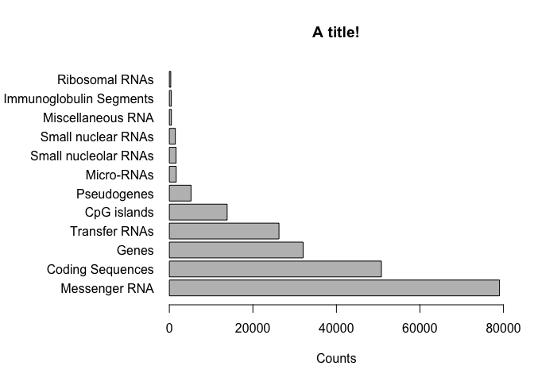

Class05
================
zachgoldberg
2019-11-01

``` r
# Class 5 Data Visualization 
x <- rnorm(1000)

# How many things are in x
length(x)
```

    ## [1] 1000

``` r
mean(x)
```

    ## [1] -0.01477141

``` r
sd(x)
```

    ## [1] 1.04312

``` r
summary(x)
```

    ##     Min.  1st Qu.   Median     Mean  3rd Qu.     Max. 
    ## -3.24248 -0.72248 -0.01768 -0.01477  0.67016  3.67578

``` r
boxplot(x)
```

<!-- -->

``` r
hist(x)
rug(x)
```

<!-- -->

``` r
weight_chart <- read.table("bimm143_05_rstats/weight_chart.txt", header = TRUE)
plot(weight_chart, type = 'o', pch = 15, ylim = c(2,10), xlab = 'Age', 
     ylab = 'weight', main = "Baby Weight with Age", col = 'blue', cex = 1.5, lwd = 2)
```

<!-- -->

``` r
mouse <- read.delim(file = "bimm143_05_rstats/feature_counts.txt", header = TRUE)

par(mar = c(5,11.1,4.1,2))
barplot(mouse$Count, horiz = TRUE, names.arg = mouse$Feature,
        las = 1, main = "A title!", xlab = 'Counts', xlim =c(0,80000))
```

<!-- -->

``` r
# 2C Histograms

x <- c(rnorm(10000), rnorm(10000) +4)
hist(x, breaks = 50)
```

<!-- -->

``` r
dev.off()
```

    ## null device 
    ##           1

``` r
# Plotting with color
mf <-read.delim("bimm143_05_rstats/male_female_counts.txt", header = TRUE)

barplot(mf$Count, col = rainbow(nrow(mf)), names.arg = mf$Sample, las = 2, 
        ylab = "Counts")

barplot(mf$Count, col = c("blue2", "red2"), names.arg = mf$Sample, las = 2, 
        ylab = "Counts")


pattern <- "D[[:digit:]] "
replacement <- ""
sub(pattern, replacement, levels(mf$Sample))
```

    ##  [1] "Female" "Male"   "Female" "Male"   "Female" "Male"   "Female"
    ##  [8] "Male"   "Female" "Male"

``` r
mf$Sample <- gsub(pattern, replacement, mf$Sample)
factor(mf$Sample)
```

    ##  [1] Male   Female Male   Female Male   Female Male   Female Male   Female
    ## Levels: Female Male

``` r
# 3B Coloring by value

ud <- read.delim("bimm143_05_rstats/up_down_expression.txt")
nrow(ud)
```

    ## [1] 5196

``` r
table(ud$State)
```

    ## 
    ##       down unchanging         up 
    ##         72       4997        127

``` r
palette(c("red", "gray", "green"))
plot(ud$Condition1, ud$Condition2, col = ud$State, 
     xlab = "Expression condition 1", ylab = "Expression condition 2")

# 3C Coloring by point density

meth <- read.delim("bimm143_05_rstats/expression_methylation.txt")
nrow(meth)
```

    ## [1] 9241

``` r
dcols <- densCols(meth$gene.meth, meth$expression)
plot(meth$gene.meth, meth$expression, col = dcols, pch = 20)

inds <- meth$expression > 0
dcols <- densCols(meth$gene.meth[inds], meth$expression[inds])
plot(meth$gene.meth[inds], meth$expression[inds], col = dcols, pch = 20)


inds <- meth$expression > 0
dcols.custom <- densCols(meth$gene.meth[inds], meth$expression[inds], 
                          colramp = colorRampPalette(c('green', 'red')))
plot(meth$gene.meth[inds], meth$expression[inds], col = dcols.custom, pch = 20)
```
