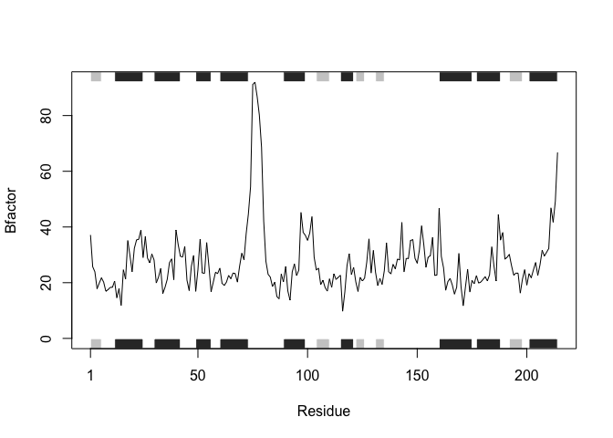
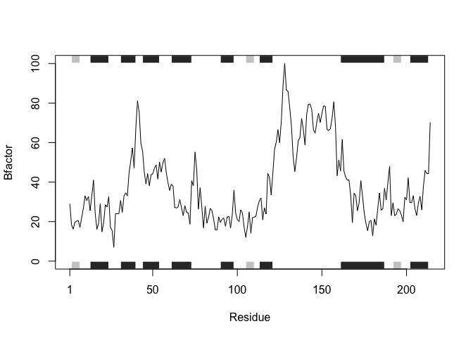
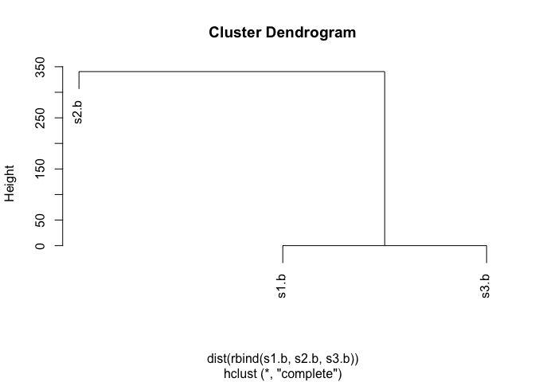

Class 6 R Functions
================
Zach Goldberg
10/18/2019

\#Importing different flat files

Test1

``` r
test1 <- read.csv("test1.txt", header = TRUE)
test1
```

    ##   Col1 Col2 Col3
    ## 1    1    2    3
    ## 2    4    5    6
    ## 3    7    8    9
    ## 4    a    b    c

Test2

``` r
test2 <- read.table("test2.txt", header = TRUE, sep = "$")
test2
```

    ##   Col1 Col2 Col3
    ## 1    1    2    3
    ## 2    4    5    6
    ## 3    7    8    9
    ## 4    a    b    c

Test 3

``` r
test3 <- read.table("test3.txt", sep = "", header = FALSE)
test3
```

    ##   V1 V2 V3
    ## 1  1  6  a
    ## 2  2  7  b
    ## 3  3  8  c
    ## 4  4  9  d
    ## 5  5 10  e

\#Writing a function

\#\#\#Original code

``` r
# Can you improve this analysis code? 
library(bio3d)
s1 <- read.pdb("4AKE") # kinase with drug 
```

    ##   Note: Accessing on-line PDB file

``` r
s2 <- read.pdb("1AKE") # kinase no drug 
```

    ##   Note: Accessing on-line PDB file
    ##    PDB has ALT records, taking A only, rm.alt=TRUE

``` r
s3 <- read.pdb("1E4Y") # kinase with drug
```

    ##   Note: Accessing on-line PDB file

``` r
s1.chainA <- trim.pdb(s1, chain="A", elety="CA") 
s2.chainA <- trim.pdb(s2, chain="A", elety="CA") 
s3.chainA <- trim.pdb(s1, chain="A", elety="CA")
s1.b <- s1.chainA$atom$b 
s2.b <- s2.chainA$atom$b 
s3.b <- s3.chainA$atom$b
plotb3(s1.b, sse=s1.chainA, typ="l", ylab="Bfactor") 
```

<!-- -->

``` r
plotb3(s2.b, sse=s2.chainA, typ="l", ylab="Bfactor") 
```

<!-- -->

``` r
plotb3(s3.b, sse=s3.chainA, typ="l", ylab="Bfactor")
```

<!-- -->

``` r
hc <- hclust( dist( rbind(s1.b, s2.b, s3.b) ) ) 
plot(hc)
```

<!-- -->

\#\#\#Snippet from original code above

``` r
library(bio3d)

x <- read.pdb("4AKE")
```

    ##   Note: Accessing on-line PDB file

    ## Warning in get.pdb(file, path = tempdir(), verbose = FALSE): /var/folders/
    ## n6/vt0h0w411wq3_8rz3b1yc6qw0000gp/T//RtmpCb2FI1/4AKE.pdb exists. Skipping
    ## download

``` r
x.chainA <- trim.pdb(x, chain="A", elety="CA") 
x.b <- x.chainA$atom$b 
plotb3(x.b, sse=x.chainA, typ="l", ylab="Bfactor") 
```

<!-- --> \#\#\#
Function from snippet

``` r
bfactor.plot <- function(p){
  require(bio3d)
  x <- read.pdb(p)
  x.chainA <- trim.pdb(x, chain="A", elety="CA") 
  x.b <- x.chainA$atom$b 
  plotb3(x.b, sse=x.chainA, typ="l", ylab="Bfactor") 
}

bfactor.plot("4AKE")
```

    ##   Note: Accessing on-line PDB file

    ## Warning in get.pdb(file, path = tempdir(), verbose = FALSE): /var/folders/
    ## n6/vt0h0w411wq3_8rz3b1yc6qw0000gp/T//RtmpCb2FI1/4AKE.pdb exists. Skipping
    ## download

<!-- --> Function
that works with vectors

``` r
apply
```

    ## function (X, MARGIN, FUN, ...) 
    ## {
    ##     FUN <- match.fun(FUN)
    ##     dl <- length(dim(X))
    ##     if (!dl) 
    ##         stop("dim(X) must have a positive length")
    ##     if (is.object(X)) 
    ##         X <- if (dl == 2L) 
    ##             as.matrix(X)
    ##         else as.array(X)
    ##     d <- dim(X)
    ##     dn <- dimnames(X)
    ##     ds <- seq_len(dl)
    ##     if (is.character(MARGIN)) {
    ##         if (is.null(dnn <- names(dn))) 
    ##             stop("'X' must have named dimnames")
    ##         MARGIN <- match(MARGIN, dnn)
    ##         if (anyNA(MARGIN)) 
    ##             stop("not all elements of 'MARGIN' are names of dimensions")
    ##     }
    ##     s.call <- ds[-MARGIN]
    ##     s.ans <- ds[MARGIN]
    ##     d.call <- d[-MARGIN]
    ##     d.ans <- d[MARGIN]
    ##     dn.call <- dn[-MARGIN]
    ##     dn.ans <- dn[MARGIN]
    ##     d2 <- prod(d.ans)
    ##     if (d2 == 0L) {
    ##         newX <- array(vector(typeof(X), 1L), dim = c(prod(d.call), 
    ##             1L))
    ##         ans <- forceAndCall(1, FUN, if (length(d.call) < 2L) newX[, 
    ##             1] else array(newX[, 1L], d.call, dn.call), ...)
    ##         return(if (is.null(ans)) ans else if (length(d.ans) < 
    ##             2L) ans[1L][-1L] else array(ans, d.ans, dn.ans))
    ##     }
    ##     newX <- aperm(X, c(s.call, s.ans))
    ##     dim(newX) <- c(prod(d.call), d2)
    ##     ans <- vector("list", d2)
    ##     if (length(d.call) < 2L) {
    ##         if (length(dn.call)) 
    ##             dimnames(newX) <- c(dn.call, list(NULL))
    ##         for (i in 1L:d2) {
    ##             tmp <- forceAndCall(1, FUN, newX[, i], ...)
    ##             if (!is.null(tmp)) 
    ##                 ans[[i]] <- tmp
    ##         }
    ##     }
    ##     else for (i in 1L:d2) {
    ##         tmp <- forceAndCall(1, FUN, array(newX[, i], d.call, 
    ##             dn.call), ...)
    ##         if (!is.null(tmp)) 
    ##             ans[[i]] <- tmp
    ##     }
    ##     ans.list <- is.recursive(ans[[1L]])
    ##     l.ans <- length(ans[[1L]])
    ##     ans.names <- names(ans[[1L]])
    ##     if (!ans.list) 
    ##         ans.list <- any(lengths(ans) != l.ans)
    ##     if (!ans.list && length(ans.names)) {
    ##         all.same <- vapply(ans, function(x) identical(names(x), 
    ##             ans.names), NA)
    ##         if (!all(all.same)) 
    ##             ans.names <- NULL
    ##     }
    ##     len.a <- if (ans.list) 
    ##         d2
    ##     else length(ans <- unlist(ans, recursive = FALSE))
    ##     if (length(MARGIN) == 1L && len.a == d2) {
    ##         names(ans) <- if (length(dn.ans[[1L]])) 
    ##             dn.ans[[1L]]
    ##         ans
    ##     }
    ##     else if (len.a == d2) 
    ##         array(ans, d.ans, dn.ans)
    ##     else if (len.a && len.a%%d2 == 0L) {
    ##         if (is.null(dn.ans)) 
    ##             dn.ans <- vector(mode = "list", length(d.ans))
    ##         dn1 <- list(ans.names)
    ##         if (length(dn.call) && !is.null(n1 <- names(dn <- dn.call[1])) && 
    ##             nzchar(n1) && length(ans.names) == length(dn[[1]])) 
    ##             names(dn1) <- n1
    ##         dn.ans <- c(dn1, dn.ans)
    ##         array(ans, c(len.a%/%d2, d.ans), if (!is.null(names(dn.ans)) || 
    ##             !all(vapply(dn.ans, is.null, NA))) 
    ##             dn.ans)
    ##     }
    ##     else ans
    ## }
    ## <bytecode: 0x7f864d80c008>
    ## <environment: namespace:base>
