Class08
================
Zach Goldberg
10/25/2019

## K-means example

Make example data

``` r
tmp <- c(rnorm(30,-3), rnorm(30,3)) 
x <- cbind(x=tmp, y=rev(tmp))
plot(x)
```

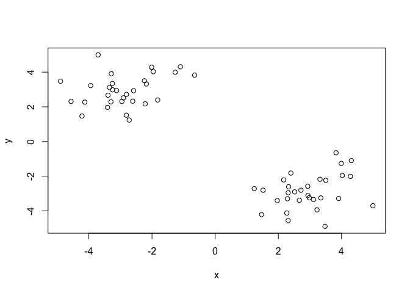<!-- -->

Clustering

``` r
km <- kmeans(x, centers = 2, nstart = 20)
```

Inspect/print the results

``` r
km
```

    ## K-means clustering with 2 clusters of sizes 30, 30
    ## 
    ## Cluster means:
    ##           x         y
    ## 1  2.944251 -2.888071
    ## 2 -2.888071  2.944251
    ## 
    ## Clustering vector:
    ##  [1] 2 2 2 2 2 2 2 2 2 2 2 2 2 2 2 2 2 2 2 2 2 2 2 2 2 2 2 2 2 2 1 1 1 1 1
    ## [36] 1 1 1 1 1 1 1 1 1 1 1 1 1 1 1 1 1 1 1 1 1 1 1 1 1
    ## 
    ## Within cluster sum of squares by cluster:
    ## [1] 52.68033 52.68033
    ##  (between_SS / total_SS =  90.6 %)
    ## 
    ## Available components:
    ## 
    ## [1] "cluster"      "centers"      "totss"        "withinss"    
    ## [5] "tot.withinss" "betweenss"    "size"         "iter"        
    ## [9] "ifault"

Q. How many points are in each cluster? 30 in each Q. What ‘component’
of your result object details - cluster size?
*km\(size* - cluster assignment/membership? *km\)cluters* - cluster
center *km$center*?

Plot x colored by the kmeans cluster assignment and add cluster centers
as blue points

``` r
cl <- km$cluster
table(cl)
```

    ## cl
    ##  1  2 
    ## 30 30

``` r
cl[cl==1] <- "blue"
cl[cl==2] <- "red"

plot(x, col = cl, pch =16)
points(km$centers, pch = 1, cex = 2)
```

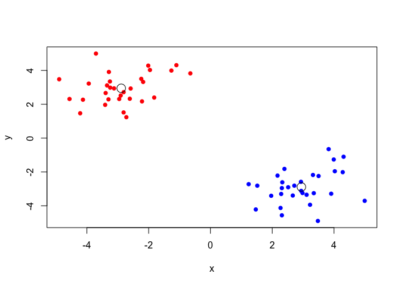<!-- -->

## Hierarchical Clustering

``` r
# First we need to calculate point (dis)similarity 
# as the Euclidean distance between observations 
dist_matrix <- dist(x)

# The hclust() function returns a hierarchical # clustering model

hc <- hclust(d = dist_matrix)

# the print method is not so useful here
hc
```

    ## 
    ## Call:
    ## hclust(d = dist_matrix)
    ## 
    ## Cluster method   : complete 
    ## Distance         : euclidean 
    ## Number of objects: 60

``` r
dist_matrix <- dist(x)

# Our input is a distance matrix from the dist() 
# function. Lets make sure we understand it first

dist_matrix <- dist(x)

dim(dist_matrix)
```

    ## NULL

``` r
## View( as.matrix(dist_matrix) )
dim(x)
```

    ## [1] 60  2

``` r
hc <- hclust(dist(x))
```

We can plot the results as a dendrogram

``` r
plot(hc)
```

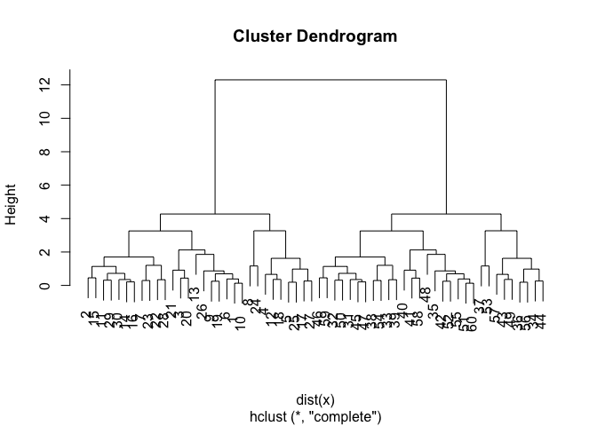<!-- -->

Can ‘cut’ tree by height

``` r
plot(hc)
abline(h=6, col="red")
abline(h=4, col = "blue")
```

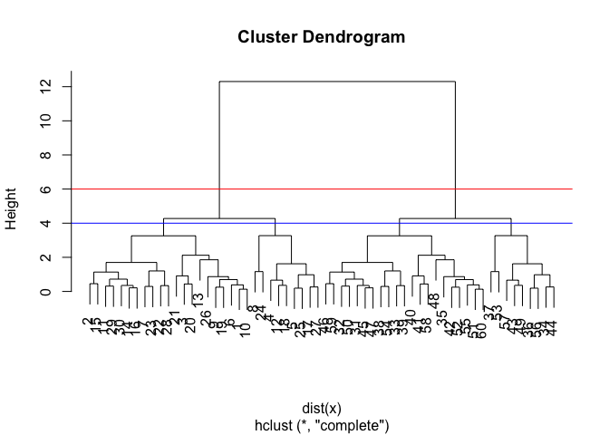<!-- -->

``` r
cuth6 <- cutree(hc, h=6) # Cut by height h=6
table(cuth6)
```

    ## cuth6
    ##  1  2 
    ## 30 30

``` r
cuth4 <- table(cutree(hc, h=4)) # Cut by height h=4
table(cuth4)
```

    ## cuth4
    ##  9 21 
    ##  2  2

Can also cut by desired K

``` r
plot(hc)
```

<!-- -->

``` r
cutbyk <- cutree(hc, k = 2)
plot(x, col = cutbyk)
```

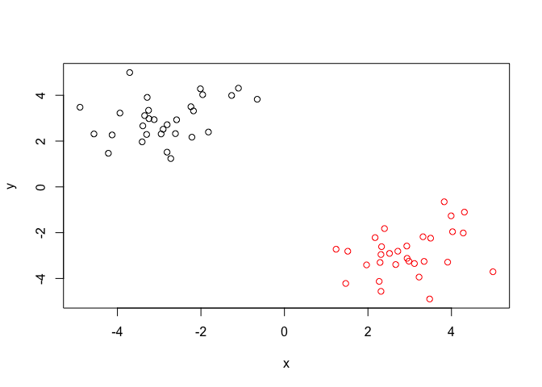<!-- -->

``` r
table(cutbyk)
```

    ## cutbyk
    ##  1  2 
    ## 30 30

My turn

``` r
# Step 1. Generate some example data for clustering
x <- rbind(
matrix(rnorm(100, mean=0, sd = 0.3), ncol = 2), # c1 
matrix(rnorm(100, mean = 1, sd = 0.3), ncol = 2), # c2 
matrix(c(rnorm(50, mean = 1, sd = 0.3), # c3
rnorm(50, mean = 0, sd = 0.3)), ncol = 2)) 
colnames(x) <- c("x", "y")

# Step 2. Plot the data without clustering
plot(x)
```

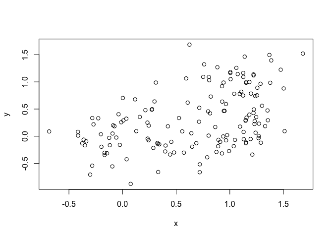<!-- -->

``` r
# Step 3. Generate colors for known clusters
# (just so we can compare to hclust results) 
col <- as.factor( rep(c("c1","c2","c3"), each=50) )
plot(x, col=col)
```

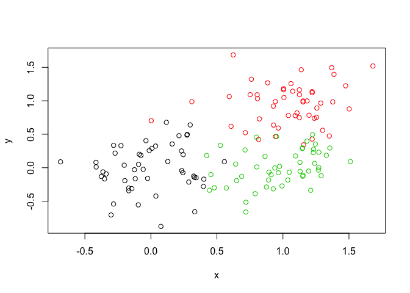<!-- -->

Q. Use the dist(), hclust(), plot() and cutree() functions to return 2
and 3 clusters Q. How does this compare to your known ‘col’ groups?

``` r
par(mfrow=c(2,2))

hc <- hclust(dist(x))
plot(hc)

plot(x, col=col, main = "Known clusters")

cut1 <- cutree(hc, k= 2)
table(cut1)
```

    ## cut1
    ##   1   2 
    ## 113  37

``` r
plot(x, col = cut1, main = "HC with k=2")

cut2 <- cutree(hc, k = 3)
table(cut2, col) #cross tablulate
```

    ##     col
    ## cut2 c1 c2 c3
    ##    1 14 13 50
    ##    2 36  0  0
    ##    3  0 37  0

``` r
plot(x, col = cut2, main = "HC with k=3" )
```

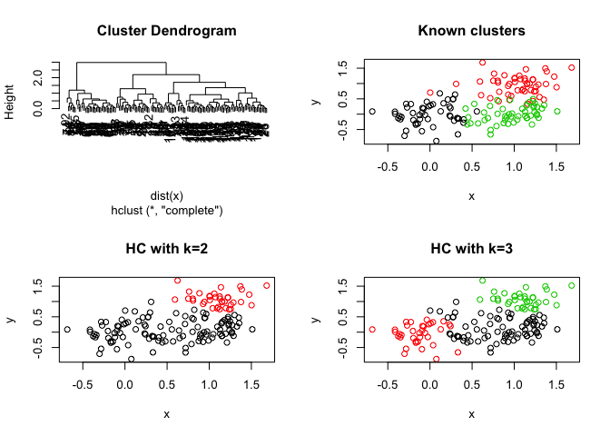<!-- -->

## PCA

Download and read in data

``` r
mydata <- read.csv("https://tinyurl.com/expression-CSV",
row.names=1) #row.names = 1 removes the weird X thing for the first column
head(mydata) #quick overview
```

    ##        wt1 wt2  wt3  wt4 wt5 ko1 ko2 ko3 ko4 ko5
    ## gene1  439 458  408  429 420  90  88  86  90  93
    ## gene2  219 200  204  210 187 427 423 434 433 426
    ## gene3 1006 989 1030 1017 973 252 237 238 226 210
    ## gene4  783 792  829  856 760 849 856 835 885 894
    ## gene5  181 249  204  244 225 277 305 272 270 279
    ## gene6  460 502  491  491 493 612 594 577 618 638

``` r
dim(mydata) #rows and columns
```

    ## [1] 100  10

Call prcomp

``` r
pca <- prcomp(t(mydata), scale=TRUE)
attributes(pca)
```

    ## $names
    ## [1] "sdev"     "rotation" "center"   "scale"    "x"       
    ## 
    ## $class
    ## [1] "prcomp"

The returned
pca\(x here contains the principal components (PCs) for drawing our first graph. Here we will take the first two columns in pca\)x
(corresponding to PC1 and PC2) to draw a 2-D
    plot

``` r
head(pca$x)
```

    ##           PC1        PC2        PC3        PC4        PC5        PC6
    ## wt1 -9.697374  1.5233313 -0.2753567  0.7322391 -0.6749398 -1.1823860
    ## wt2 -9.138950  0.3748504  1.0867958 -1.9461655  0.7571209  0.4369228
    ## wt3 -9.054263 -0.9855163  0.4152966  1.4166028  0.5835918 -0.6937236
    ## wt4 -8.731483 -0.7468371  0.5875748  0.2268129 -1.5404775  1.2723618
    ## wt5 -9.006312 -0.2945307 -1.8498101 -0.4303812  0.8666124  0.2496025
    ## ko1  8.846999  2.2345475 -0.1462750 -1.1544333 -0.6947862 -0.7128021
    ##             PC7         PC8         PC9         PC10
    ## wt1  0.24446614  1.03519396  0.07010231 3.691492e-15
    ## wt2  0.03275370  0.26622249  0.72780448 3.080869e-15
    ## wt3  0.03578383 -1.05851494  0.52979799 2.595146e-15
    ## wt4  0.52795595 -0.20995085 -0.50325679 3.122502e-15
    ## wt5 -0.83227047 -0.05891489 -0.81258430 3.302913e-15
    ## ko1  0.07864392 -0.94652648 -0.24613776 3.351486e-15

``` r
plot(pca$x[,1], pca$x[,2])
```

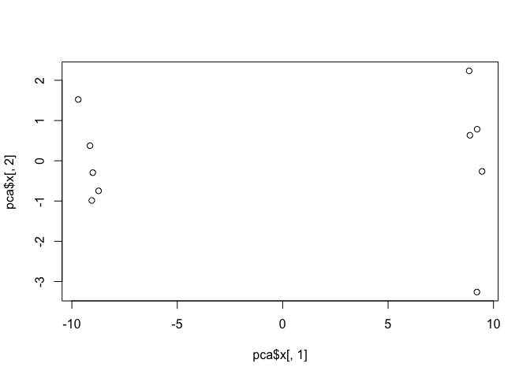<!-- -->

``` r
summary(pca)
```

    ## Importance of components:
    ##                           PC1    PC2     PC3     PC4     PC5     PC6
    ## Standard deviation     9.6237 1.5198 1.05787 1.05203 0.88062 0.82545
    ## Proportion of Variance 0.9262 0.0231 0.01119 0.01107 0.00775 0.00681
    ## Cumulative Proportion  0.9262 0.9493 0.96045 0.97152 0.97928 0.98609
    ##                            PC7     PC8     PC9      PC10
    ## Standard deviation     0.80111 0.62065 0.60342 3.348e-15
    ## Proportion of Variance 0.00642 0.00385 0.00364 0.000e+00
    ## Cumulative Proportion  0.99251 0.99636 1.00000 1.000e+00

Scree plot

``` r
pca.var <- pca$sdev^2
pca.var.per <- round(pca.var/sum(pca.var)*100, 1)
barplot(pca.var.per, main="Scree Plot",
 xlab="Principal Component", ylab=)
```

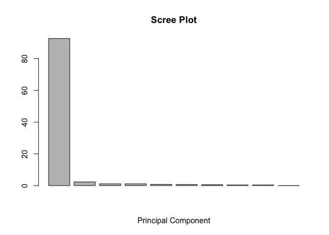<!-- --> A pretty
plot

``` r
## A vector of colors for wt and ko samples
colvec <- as.factor( substr( colnames(mydata), 1, 2) )
plot(pca$x[,1], pca$x[,2], col=colvec, pch=16,
xlab=paste0("PC1 (", pca.var.per[1], "%)"), ylab=paste0("PC2 (", pca.var.per[2], "%)"))
identify(pca$x[,1], pca$x[,2], labels=colnames(mydata))
```

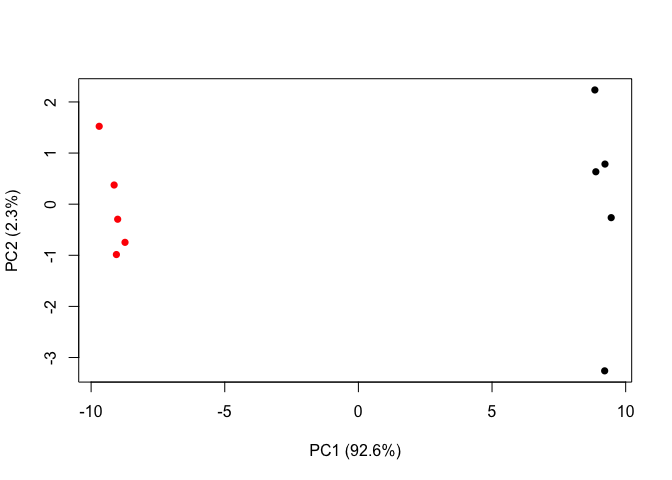<!-- -->

    ## integer(0)

## Hands on Example with UK foods

``` r
x <- read.csv("https://bioboot.github.io/bggn213_f17/class-material/UK_foods.csv", row.names = 1)
dim(x)
```

    ## [1] 17  4

``` r
head(x)
```

    ##                England Wales Scotland N.Ireland
    ## Cheese             105   103      103        66
    ## Carcass_meat       245   227      242       267
    ## Other_meat         685   803      750       586
    ## Fish               147   160      122        93
    ## Fats_and_oils      193   235      184       209
    ## Sugars             156   175      147       139

Explore

``` r
par(mfrow = c(1,2))
barplot(as.matrix(x), beside=T, col=rainbow(nrow(x)))
barplot(as.matrix(x), beside=F, col=rainbow(nrow(x)))
```

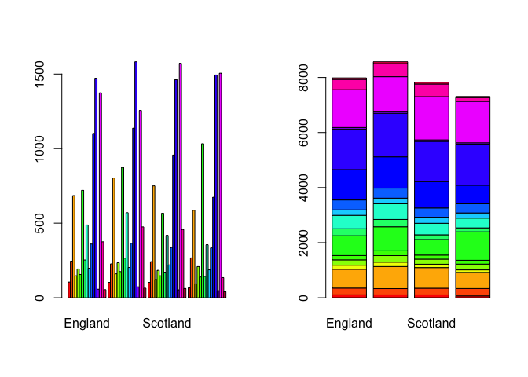<!-- -->

``` r
pairs(x, col=rainbow(10), pch=16)
```

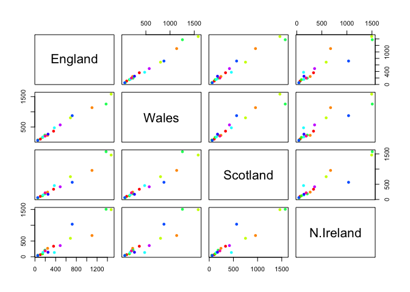<!-- -->

PCA to the rescue

``` r
pca <- prcomp(t(x))
summary(pca)
```

    ## Importance of components:
    ##                             PC1      PC2      PC3       PC4
    ## Standard deviation     324.1502 212.7478 73.87622 4.189e-14
    ## Proportion of Variance   0.6744   0.2905  0.03503 0.000e+00
    ## Cumulative Proportion    0.6744   0.9650  1.00000 1.000e+00

Plot
PCA

``` r
plot(pca$x[,1], pca$x[,2], xlab="PC1", ylab="PC2", xlim=c(-270,500), col = c("red", "green", "blue", "orange"))
text(pca$x[,1], pca$x[,2], colnames(x), col = c("red", "green", "blue", "orange"))
```

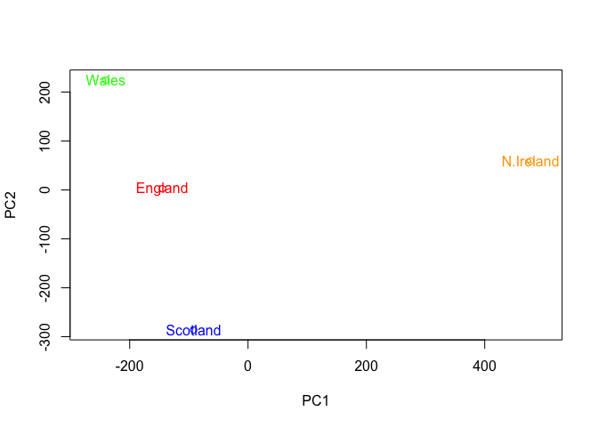<!-- -->

Below we can use the square of pca$sdev , which stands for “standard
deviation”, to calculate how much variation in the original data each PC
accounts for.

``` r
v <- round( pca$sdev^2/sum(pca$sdev^2) * 100 )
v
```

    ## [1] 67 29  4  0

or the second row here…

``` r
z <- summary(pca)
z$importance
```

    ##                              PC1       PC2      PC3          PC4
    ## Standard deviation     324.15019 212.74780 73.87622 4.188568e-14
    ## Proportion of Variance   0.67444   0.29052  0.03503 0.000000e+00
    ## Cumulative Proportion    0.67444   0.96497  1.00000 1.000000e+00

This information can be summarized in a plot of the variances
(eigenvalues) with respect to the principal component number
(eigenvector number), which is given below.

``` r
barplot(v, xlab="Principal Component", ylab="Percent Variation")
```

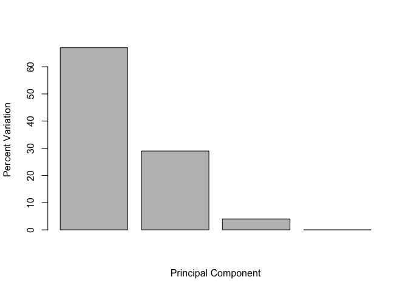<!-- -->

Lets focus on PC1 as it accounts for \> 90% of variance

``` r
par(mar=c(10, 3, 0.35, 0))
barplot( pca$rotation[,1], las=2 )
```

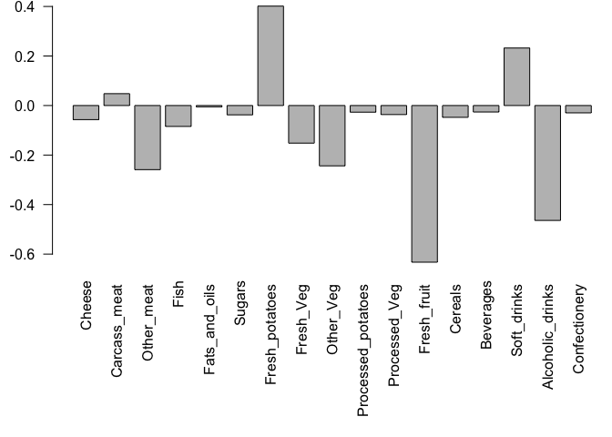<!-- -->
