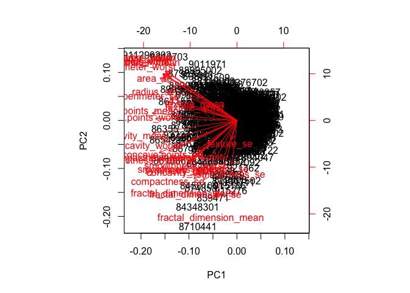
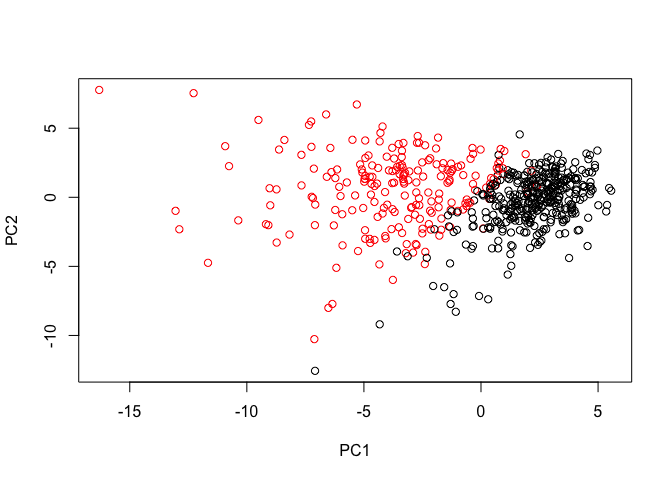
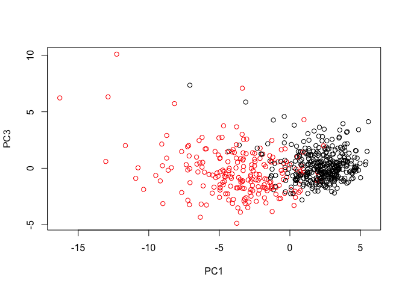
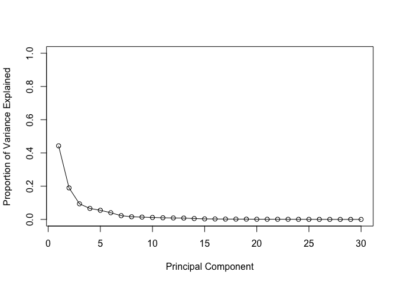
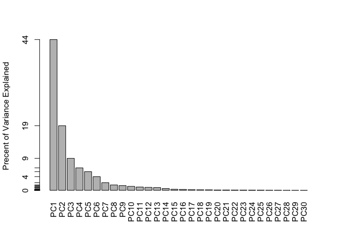
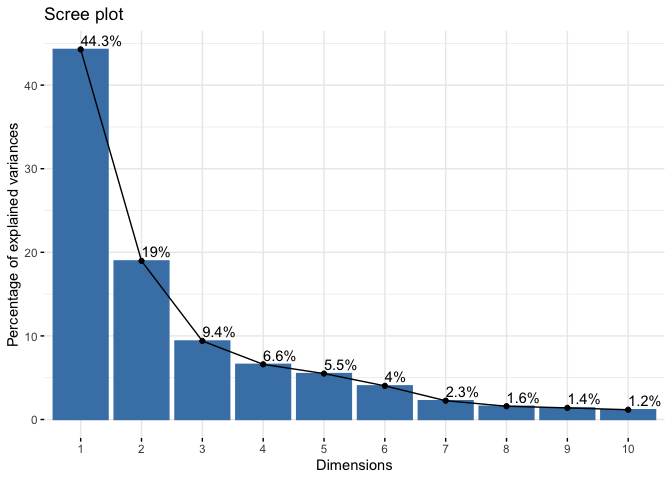
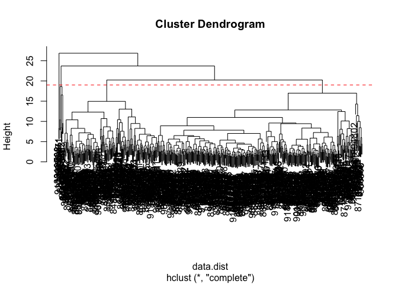
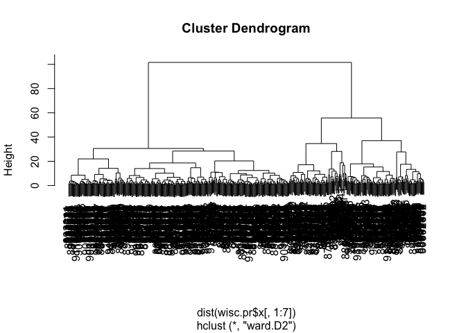
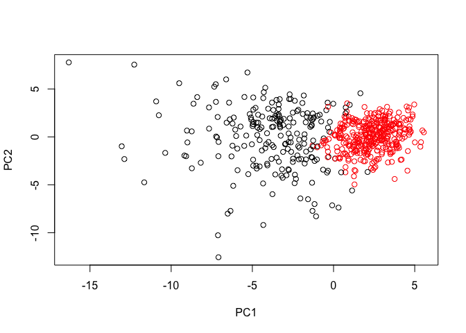
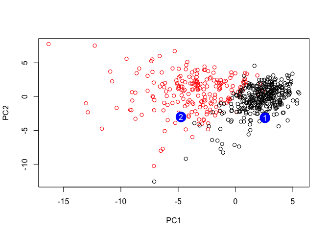

Class09 Breast Cancer Miniproject
================
Zach Goldberg
10/30/2019

## Mini project <https://bioboot.github.io/bggn213_F19/class-material/lab-9-bggn213-WEBX.html#background>

Read in data and look at it

``` r
url = "WisconsinCancer.csv"
wisc.df <- read.csv(url)
head(wisc.df)
```

    ##         id diagnosis radius_mean texture_mean perimeter_mean area_mean
    ## 1   842302         M       17.99        10.38         122.80    1001.0
    ## 2   842517         M       20.57        17.77         132.90    1326.0
    ## 3 84300903         M       19.69        21.25         130.00    1203.0
    ## 4 84348301         M       11.42        20.38          77.58     386.1
    ## 5 84358402         M       20.29        14.34         135.10    1297.0
    ## 6   843786         M       12.45        15.70          82.57     477.1
    ##   smoothness_mean compactness_mean concavity_mean concave.points_mean
    ## 1         0.11840          0.27760         0.3001             0.14710
    ## 2         0.08474          0.07864         0.0869             0.07017
    ## 3         0.10960          0.15990         0.1974             0.12790
    ## 4         0.14250          0.28390         0.2414             0.10520
    ## 5         0.10030          0.13280         0.1980             0.10430
    ## 6         0.12780          0.17000         0.1578             0.08089
    ##   symmetry_mean fractal_dimension_mean radius_se texture_se perimeter_se
    ## 1        0.2419                0.07871    1.0950     0.9053        8.589
    ## 2        0.1812                0.05667    0.5435     0.7339        3.398
    ## 3        0.2069                0.05999    0.7456     0.7869        4.585
    ## 4        0.2597                0.09744    0.4956     1.1560        3.445
    ## 5        0.1809                0.05883    0.7572     0.7813        5.438
    ## 6        0.2087                0.07613    0.3345     0.8902        2.217
    ##   area_se smoothness_se compactness_se concavity_se concave.points_se
    ## 1  153.40      0.006399        0.04904      0.05373           0.01587
    ## 2   74.08      0.005225        0.01308      0.01860           0.01340
    ## 3   94.03      0.006150        0.04006      0.03832           0.02058
    ## 4   27.23      0.009110        0.07458      0.05661           0.01867
    ## 5   94.44      0.011490        0.02461      0.05688           0.01885
    ## 6   27.19      0.007510        0.03345      0.03672           0.01137
    ##   symmetry_se fractal_dimension_se radius_worst texture_worst
    ## 1     0.03003             0.006193        25.38         17.33
    ## 2     0.01389             0.003532        24.99         23.41
    ## 3     0.02250             0.004571        23.57         25.53
    ## 4     0.05963             0.009208        14.91         26.50
    ## 5     0.01756             0.005115        22.54         16.67
    ## 6     0.02165             0.005082        15.47         23.75
    ##   perimeter_worst area_worst smoothness_worst compactness_worst
    ## 1          184.60     2019.0           0.1622            0.6656
    ## 2          158.80     1956.0           0.1238            0.1866
    ## 3          152.50     1709.0           0.1444            0.4245
    ## 4           98.87      567.7           0.2098            0.8663
    ## 5          152.20     1575.0           0.1374            0.2050
    ## 6          103.40      741.6           0.1791            0.5249
    ##   concavity_worst concave.points_worst symmetry_worst
    ## 1          0.7119               0.2654         0.4601
    ## 2          0.2416               0.1860         0.2750
    ## 3          0.4504               0.2430         0.3613
    ## 4          0.6869               0.2575         0.6638
    ## 5          0.4000               0.1625         0.2364
    ## 6          0.5355               0.1741         0.3985
    ##   fractal_dimension_worst  X
    ## 1                 0.11890 NA
    ## 2                 0.08902 NA
    ## 3                 0.08758 NA
    ## 4                 0.17300 NA
    ## 5                 0.07678 NA
    ## 6                 0.12440 NA

``` r
table <- table(wisc.df$diagnosis)
```

Here we examine data from 569 patients, of which 357 are benign and 212
are malignant

``` r
wisc.data <- as.matrix(wisc.df[,3:32])
row.names(wisc.data) <- wisc.df$id

diagnosis <- wisc.df$diagnosis
diagnosis
```

    ##   [1] M M M M M M M M M M M M M M M M M M M B B B M M M M M M M M M M M M M
    ##  [36] M M B M M M M M M M M B M B B B B B M M B M M B B B B M B M M B B B B
    ##  [71] M B M M B M B M M B B B M M B M M M B B B M B B M M B B B M M B B B B
    ## [106] M B B M B B B B B B B B M M M B M M B B B M M B M B M M B M M B B M B
    ## [141] B M B B B B M B B B B B B B B B M B B B B M M B M B B M M B B M M B B
    ## [176] B B M B B M M M B M B M B B B M B B M M B M M M M B M M M B M B M B B
    ## [211] M B M M M M B B M M B B B M B B B B B M M B B M B B M M B M B B B B M
    ## [246] B B B B B M B M M M M M M M M M M M M M M B B B B B B M B M B B M B B
    ## [281] M B M M B B B B B B B B B B B B B M B B M B M B B B B B B B B B B B B
    ## [316] B B M B B B M B M B B B B M M M B B B B M B M B M B B B M B B B B B B
    ## [351] B M M M B B B B B B B B B B B M M B M M M B M M B B B B B M B B B B B
    ## [386] M B B B M B B M M B B B B B B M B B B B B B B M B B B B B M B B M B B
    ## [421] B B B B B B B B B B M B M M B M B B B B B M B B M B M B B M B M B B B
    ## [456] B B B B B M M B B B B B B M B B B B B B B B B B M B B B B B B B M B M
    ## [491] B B M B B B B B M M B M B M B B B B B M B B M B M B M M B B B M B B B
    ## [526] B B B B B B B B M B M M B B B B B B B B B B B B B B B B B B B B B B B
    ## [561] B B M M M M M M B
    ## Levels: B M

How many columns end with ’\_mean’?

``` r
length(grep("_mean$", colnames(wisc.data)))
```

    ## [1] 10

Does the data need to be scaled for PCA? How to check:

``` r
col.means <- colMeans(wisc.data)
round(apply(wisc.data,2,sd), 2)
```

    ##             radius_mean            texture_mean          perimeter_mean 
    ##                    3.52                    4.30                   24.30 
    ##               area_mean         smoothness_mean        compactness_mean 
    ##                  351.91                    0.01                    0.05 
    ##          concavity_mean     concave.points_mean           symmetry_mean 
    ##                    0.08                    0.04                    0.03 
    ##  fractal_dimension_mean               radius_se              texture_se 
    ##                    0.01                    0.28                    0.55 
    ##            perimeter_se                 area_se           smoothness_se 
    ##                    2.02                   45.49                    0.00 
    ##          compactness_se            concavity_se       concave.points_se 
    ##                    0.02                    0.03                    0.01 
    ##             symmetry_se    fractal_dimension_se            radius_worst 
    ##                    0.01                    0.00                    4.83 
    ##           texture_worst         perimeter_worst              area_worst 
    ##                    6.15                   33.60                  569.36 
    ##        smoothness_worst       compactness_worst         concavity_worst 
    ##                    0.02                    0.16                    0.21 
    ##    concave.points_worst          symmetry_worst fractal_dimension_worst 
    ##                    0.07                    0.06                    0.02

Yes, the data needs to be scaled\!

Call prcomp()

``` r
wisc.pr <- prcomp(wisc.data, scale = T)
summary(wisc.pr)
```

    ## Importance of components:
    ##                           PC1    PC2     PC3     PC4     PC5     PC6
    ## Standard deviation     3.6444 2.3857 1.67867 1.40735 1.28403 1.09880
    ## Proportion of Variance 0.4427 0.1897 0.09393 0.06602 0.05496 0.04025
    ## Cumulative Proportion  0.4427 0.6324 0.72636 0.79239 0.84734 0.88759
    ##                            PC7     PC8    PC9    PC10   PC11    PC12
    ## Standard deviation     0.82172 0.69037 0.6457 0.59219 0.5421 0.51104
    ## Proportion of Variance 0.02251 0.01589 0.0139 0.01169 0.0098 0.00871
    ## Cumulative Proportion  0.91010 0.92598 0.9399 0.95157 0.9614 0.97007
    ##                           PC13    PC14    PC15    PC16    PC17    PC18
    ## Standard deviation     0.49128 0.39624 0.30681 0.28260 0.24372 0.22939
    ## Proportion of Variance 0.00805 0.00523 0.00314 0.00266 0.00198 0.00175
    ## Cumulative Proportion  0.97812 0.98335 0.98649 0.98915 0.99113 0.99288
    ##                           PC19    PC20   PC21    PC22    PC23   PC24
    ## Standard deviation     0.22244 0.17652 0.1731 0.16565 0.15602 0.1344
    ## Proportion of Variance 0.00165 0.00104 0.0010 0.00091 0.00081 0.0006
    ## Cumulative Proportion  0.99453 0.99557 0.9966 0.99749 0.99830 0.9989
    ##                           PC25    PC26    PC27    PC28    PC29    PC30
    ## Standard deviation     0.12442 0.09043 0.08307 0.03987 0.02736 0.01153
    ## Proportion of Variance 0.00052 0.00027 0.00023 0.00005 0.00002 0.00000
    ## Cumulative Proportion  0.99942 0.99969 0.99992 0.99997 1.00000 1.00000

Bi-plot

``` r
biplot(wisc.pr)
```

<!-- -->

This plot is a huge mess\!

Scatter plot of PCA 1 and
2

``` r
plot(wisc.pr$x[,1], wisc.pr$x[,2], col = diagnosis, xlab = "PC1", ylab = "PC2")
```

<!-- -->

Scatter plot of PC1 and
PC3

``` r
plot(wisc.pr$x[,1], wisc.pr$x[,3], col = diagnosis, xlab = "PC1", ylab = "PC3")
```

<!-- -->

\#\#Exploring Variance

``` r
pr.var <- wisc.pr$sdev^2
head(pr.var)
```

    ## [1] 13.281608  5.691355  2.817949  1.980640  1.648731  1.207357

``` r
pve <- pr.var/sum(pr.var)
plot(pve, xlab = "Principal Component", 
     ylab = "Proportion of Variance Explained", 
     ylim = c(0, 1), type = "o")
```

<!-- -->

Alternate of above plot

``` r
barplot(pve, ylab = "Precent of Variance Explained",
     names.arg=paste0("PC",1:length(pve)), las=2, axes = FALSE)
axis(2, at=pve, labels=round(pve,2)*100 )
```

<!-- -->

Optional: There are quite a few CRAN packages that are helpful for PCA.
This includes the factoextra package. Feel free to explore this package.
For example:

``` r
## ggplot based graph
#install.packages("factoextra")
library(factoextra)
```

    ## Loading required package: ggplot2

    ## Welcome! Related Books: `Practical Guide To Cluster Analysis in R` at https://goo.gl/13EFCZ

``` r
fviz_eig(wisc.pr, addlabels = TRUE)
```

<!-- -->

## Hierarchical clustering

``` r
data.scaled <- scale(wisc.data)
data.dist <- dist(data.scaled)
wisc.hclust <- hclust(data.dist, method = "complete")
```

``` r
plot(wisc.hclust)
abline(h = 19, col="red", lty=2)
```

<!-- -->

Cut down on clusters

``` r
wisc.hclust.clusters <- cutree(wisc.hclust, 4)
table(wisc.hclust.clusters, diagnosis)
```

    ##                     diagnosis
    ## wisc.hclust.clusters   B   M
    ##                    1  12 165
    ##                    2   2   5
    ##                    3 343  40
    ##                    4   0   2

## 4\. OPTIONAL: K-means clustering

As you now know from the last class, there are two main types of
clustering: hierarchical and k-means.

In this section, you will create a k-means clustering model on the
Wisconsin breast cancer data and compare the results to the actual
diagnoses and the results of your hierarchical clustering model. If you
are running a little behind feel free to skip ahead to section 5
otherwise if you find you are flying through things please take some
time to see how each clustering model performs in terms of separating
the two diagnoses and how the clustering models compare to each other.

Create a k-means model on wisc.data, assigning the result to wisc.km. Be
sure to create 2 clusters, corresponding to the actual number of
diagnosis. Also, remember to scale the data (with the scale() function
and repeat the algorithm 20 times (by setting setting the value of the
nstart argument appropriately). Running multiple times such as this will
help to find a well performing model.

``` r
wisc.km <- kmeans(wisc.data, centers= 2, nstart= 20)
table(wisc.km$cluster, diagnosis)
```

    ##    diagnosis
    ##       B   M
    ##   1 356  82
    ##   2   1 130

Use the table() function to compare the cluster membership of the
k-means model (wisc.km$cluster) to your hierarchical clustering model
from above (wisc.hclust.clusters). Recall the cluster membership of the
hierarchical clustering model is contained in wisc.hclust.clusters
object.

``` r
table(wisc.hclust.clusters, wisc.km$cluster)
```

    ##                     
    ## wisc.hclust.clusters   1   2
    ##                    1  68 109
    ##                    2   5   2
    ##                    3 365  18
    ##                    4   0   2

## 5\. Combining methods

Clustering on PCA results In this final section, you will put together
several steps you used earlier and, in doing so, you will experience
some of the creativity and open endedness that is typical in
unsupervised learning.

Recall from earlier sections that the PCA model required significantly
fewer features to describe 70%, 80% and 95% of the variability of the
data. In addition to normalizing data and potentially avoiding
over-fitting, PCA also uncorrelates the variables, sometimes improving
the performance of other modeling techniques.

Let’s see if PCA improves or degrades the performance of hierarchical
clustering.

Using the minimum number of principal components required to describe at
least 90% of the variability in the data, create a hierarchical
clustering model with the linkage method=“ward.D2”. We use Ward’s
criterion here because it is based on multidimensional variance like
principal components analysis. Assign the results to wisc.pr.hclust.

``` r
wisc.pr.hclust <- hclust(dist(wisc.pr$x[,1:7]), method = "ward.D2")
plot(wisc.pr.hclust)
```

<!-- -->

``` r
grps <- cutree(wisc.pr.hclust, k=2)
table(grps)
```

    ## grps
    ##   1   2 
    ## 216 353

``` r
table(grps, diagnosis)
```

    ##     diagnosis
    ## grps   B   M
    ##    1  28 188
    ##    2 329  24

``` r
plot(wisc.pr$x[,1:2], col=grps)
```

<!-- -->

``` r
library(rgl)
plot3d(wisc.pr$x[,1:3], xlab="PC 1", ylab="PC 2", zlab="PC 3", cex=1.5, size=1, type="s", col=grps)
rglwidget(width = 400, height = 400)
```

``` r
wisc.pr.hclust <- hclust(dist(wisc.pr$x[,1:7]), method="ward.D2")
wisc.pr.hclust.clusters <- cutree(wisc.pr.hclust, k=2)
prhclust.table<-table(wisc.pr.hclust.clusters, diagnosis)
prhclust.table
```

    ##                        diagnosis
    ## wisc.pr.hclust.clusters   B   M
    ##                       1  28 188
    ##                       2 329  24

Q20. How well do the k-means and hierarchical clustering models you
created in previous sections (i.e. before PCA) do in terms of separating
the diagnoses? Again, use the table() function to compare the output of
each model (wisc.km$cluster and wisc.hclust.clusters) with the vector
containing the actual diagnoses.

``` r
km.table <- table(wisc.km$cluster, diagnosis)
km.table
```

    ##    diagnosis
    ##       B   M
    ##   1 356  82
    ##   2   1 130

``` r
hclust.table <- table(wisc.hclust.clusters, diagnosis)
hclust.table
```

    ##                     diagnosis
    ## wisc.hclust.clusters   B   M
    ##                    1  12 165
    ##                    2   2   5
    ##                    3 343  40
    ##                    4   0   2

## 6\. Sensitivity/Specificity

Sensitivity refers to a test’s ability to correctly detect ill patients
who do have the condition. In our example here the sensitivity is the
total number of samples in the cluster identified as predominantly
malignant (cancerous) divided by the total number of known malignant
samples.

Specificity relates to a test’s ability to correctly reject healthy
patients without a condition. In our example specificity is the
proportion of benign (not cancerous) samples in the cluster identified
as predominantly benign that are known to be benign.

``` r
prhclust.table
```

    ##                        diagnosis
    ## wisc.pr.hclust.clusters   B   M
    ##                       1  28 188
    ##                       2 329  24

``` r
km.table
```

    ##    diagnosis
    ##       B   M
    ##   1 356  82
    ##   2   1 130

``` r
hclust.table
```

    ##                     diagnosis
    ## wisc.hclust.clusters   B   M
    ##                    1  12 165
    ##                    2   2   5
    ##                    3 343  40
    ##                    4   0   2

``` r
# sens  = found malignant/all malignant
# spec = found benign/all benign 

#k means
k.sens <- km.table[1,2]/(km.table[1,2]+km.table[2,2])
k.spec <- km.table[2,1]/(km.table[1,1]+km.table[2,1])

#hc
hc.sens <- hclust.table[1,2]/sum(hclust.table[,2])
hc.spec <- hclust.table[3,1]/sum(hclust.table[,1])

#pca and hc
phc.sens <- prhclust.table[1,2]/sum(prhclust.table[,2])
phc.spec <- prhclust.table[2,1]/sum(prhclust.table[,1])

#make a matrix
spec.sens.mat <- matrix(c(k.sens,hc.sens,phc.sens,k.spec,hc.spec,phc.spec), nrow = 3, ncol = 2 )
rownames(spec.sens.mat) <- c("K-means", "HClust", "PCA HClust")
colnames(spec.sens.mat) <- c("Sensitivity", "Specificity")

spec.sens.mat
```

    ##            Sensitivity Specificity
    ## K-means      0.3867925  0.00280112
    ## HClust       0.7783019  0.96078431
    ## PCA HClust   0.8867925  0.92156863

## 7\. Prediction

We will use the predict() function that will take our PCA model from
before and new cancer cell data and project that data onto our PCA
space.

``` r
#url <- "new_samples.csv"
url <- "https://tinyurl.com/new-samples-CSV"
new <- read.csv(url)
npc <- predict(wisc.pr, newdata=new)
npc
```

    ##            PC1       PC2        PC3        PC4       PC5        PC6
    ## [1,]  2.576616 -3.135913  1.3990492 -0.7631950  2.781648 -0.8150185
    ## [2,] -4.754928 -3.009033 -0.1660946 -0.6052952 -1.140698 -1.2189945
    ##             PC7        PC8       PC9       PC10      PC11      PC12
    ## [1,] -0.3959098 -0.2307350 0.1029569 -0.9272861 0.3411457  0.375921
    ## [2,]  0.8193031 -0.3307423 0.5281896 -0.4855301 0.7173233 -1.185917
    ##           PC13     PC14      PC15       PC16        PC17        PC18
    ## [1,] 0.1610764 1.187882 0.3216974 -0.1743616 -0.07875393 -0.11207028
    ## [2,] 0.5893856 0.303029 0.1299153  0.1448061 -0.40509706  0.06565549
    ##             PC19       PC20       PC21       PC22       PC23       PC24
    ## [1,] -0.08802955 -0.2495216  0.1228233 0.09358453 0.08347651  0.1223396
    ## [2,]  0.25591230 -0.4289500 -0.1224776 0.01732146 0.06316631 -0.2338618
    ##             PC25         PC26         PC27        PC28         PC29
    ## [1,]  0.02124121  0.078884581  0.220199544 -0.02946023 -0.015620933
    ## [2,] -0.20755948 -0.009833238 -0.001134152  0.09638361  0.002795349
    ##              PC30
    ## [1,]  0.005269029
    ## [2,] -0.019015820

``` r
plot(wisc.pr$x[,1:2], col=diagnosis)
points(npc[,1], npc[,2], col="blue", pch=16, cex=3)
text(npc[,1], npc[,2], c(1,2), col="white")
```

<!-- -->

``` r
prhclust.table
```

    ##                        diagnosis
    ## wisc.pr.hclust.clusters   B   M
    ##                       1  28 188
    ##                       2 329  24
