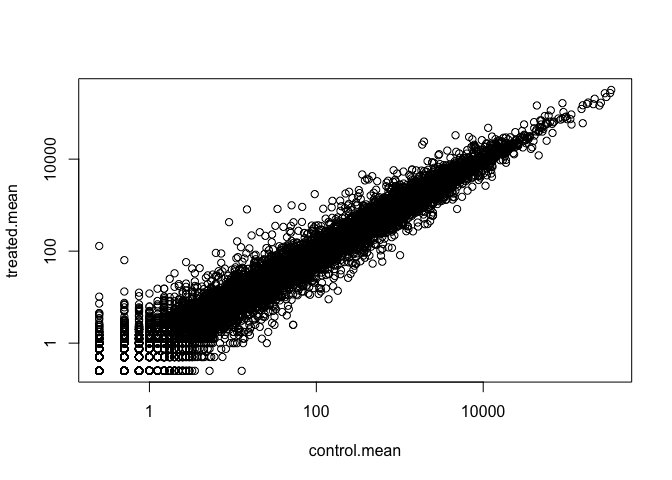
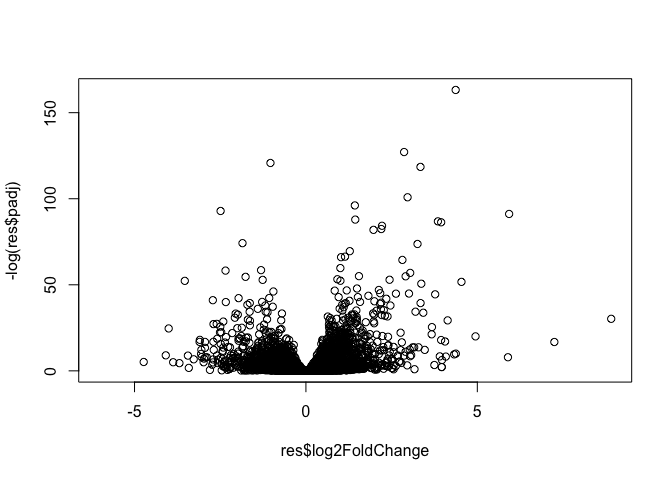
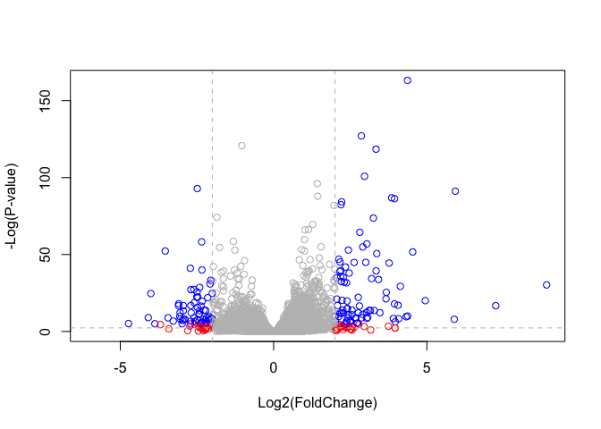
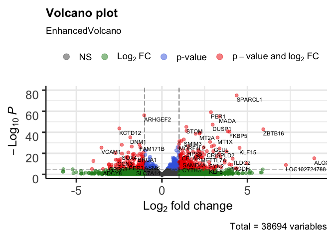

Class 14: Transcriptomics and the analysis of RNA-Seq data
================

## Background

The data for this hands-on session comes from a published RNA-seq
experiment where airway smooth muscle cells were treated with
dexamethasone, a synthetic glucocorticoid steroid with anti-inflammatory
effects (Himes et al. 2014).

Glucocorticoids are used, for example, by people with asthma to reduce
inflammation of the airways. The anti-inflammatory effects on airway
smooth muscle (ASM) cells has been known for some time but the
underlying molecular mechanisms are unclear.

Himes et al. used RNA-seq to profile gene expression changes in four
different ASM cell lines treated with dexamethasone glucocorticoid. They
found a number of differentially expressed genes comparing
dexamethasone-treated to control cells, but focus much of the discussion
on a gene called CRISPLD2. This gene encodes a secreted protein known to
be involved in lung development, and SNPs in this gene in previous GWAS
studies are associated with inhaled corticosteroid resistance and
bronchodilator response in asthma patients. They confirmed the
upregulated CRISPLD2 mRNA expression with qPCR and increased protein
expression using Western blotting.

In the experiment, four primary human ASM cell lines were treated with 1
micromolar dexamethasone for 18 hours. For each of the four cell lines,
we have a treated and an untreated sample. They did their analysis using
Tophat and Cufflinks similar to our last day’s hands-on session. For a
more detailed description of their analysis see the PubMed entry
24926665 and for raw data see the GEO entry GSE52778.

In this session we will read and explore the gene expression data from
this experiment using base R functions and then perform a detailed
analysis with the DESeq2 package from Bioconductor.

## Importing Data

``` r
counts <- read.csv("airway_scaledcounts.csv", stringsAsFactors = FALSE)
metadata <-  read.csv("airway_metadata.csv", stringsAsFactors = FALSE)
```

``` r
head(counts)
```

    ##           ensgene SRR1039508 SRR1039509 SRR1039512 SRR1039513 SRR1039516
    ## 1 ENSG00000000003        723        486        904        445       1170
    ## 2 ENSG00000000005          0          0          0          0          0
    ## 3 ENSG00000000419        467        523        616        371        582
    ## 4 ENSG00000000457        347        258        364        237        318
    ## 5 ENSG00000000460         96         81         73         66        118
    ## 6 ENSG00000000938          0          0          1          0          2
    ##   SRR1039517 SRR1039520 SRR1039521
    ## 1       1097        806        604
    ## 2          0          0          0
    ## 3        781        417        509
    ## 4        447        330        324
    ## 5         94        102         74
    ## 6          0          0          0

How many genes?

``` r
nrow(counts)
```

    ## [1] 38694

``` r
head(metadata)
```

    ##           id     dex celltype     geo_id
    ## 1 SRR1039508 control   N61311 GSM1275862
    ## 2 SRR1039509 treated   N61311 GSM1275863
    ## 3 SRR1039512 control  N052611 GSM1275866
    ## 4 SRR1039513 treated  N052611 GSM1275867
    ## 5 SRR1039516 control  N080611 GSM1275870
    ## 6 SRR1039517 treated  N080611 GSM1275871

Are count column names and metadata row names the same?

``` r
all(colnames(counts)[-1] == metadata$id)
```

    ## [1] TRUE

## Toy analysis

Firt we need to access the columns of our COuntData that are control and
then find their mean.

``` r
control.id <- metadata[metadata$dex == "control",]$id
```

``` r
head(counts[,control.id])
```

    ##   SRR1039508 SRR1039512 SRR1039516 SRR1039520
    ## 1        723        904       1170        806
    ## 2          0          0          0          0
    ## 3        467        616        582        417
    ## 4        347        364        318        330
    ## 5         96         73        118        102
    ## 6          0          1          2          0

Mean counts for control exps

``` r
control.mean <- rowSums(counts[,control.id])/length(control.id)
names(control.mean) <- counts$ensgene
```

Mean counts for treated exps

``` r
treated.id <- metadata[metadata$dex == "treated",]$id
treated.mean <- rowSums(counts[,treated.id])/length(treated.id)
names(treated.mean) <- counts$ensgene
```

Store together

``` r
meancounts <- data.frame(control.mean, treated.mean)
plot(meancounts, log = "xy")
```

    ## Warning in xy.coords(x, y, xlabel, ylabel, log): 15032 x values <= 0 omitted
    ## from logarithmic plot

    ## Warning in xy.coords(x, y, xlabel, ylabel, log): 15281 y values <= 0 omitted
    ## from logarithmic plot

<!-- -->

Calculate
Log2FC

``` r
meancounts$log2fc <- log2(meancounts[,"treated.mean"]/meancounts[,"control.mean"])

head(meancounts)
```

    ##                 control.mean treated.mean      log2fc
    ## ENSG00000000003       900.75       658.00 -0.45303916
    ## ENSG00000000005         0.00         0.00         NaN
    ## ENSG00000000419       520.50       546.00  0.06900279
    ## ENSG00000000457       339.75       316.50 -0.10226805
    ## ENSG00000000460        97.25        78.75 -0.30441833
    ## ENSG00000000938         0.75         0.00        -Inf

Exclude NaNs and infs (from zeros in
expression)

``` r
zerovals <- which(meancounts[,1:2] == 0, arr.ind = TRUE) #arr.ind returns array indicies
to.rm <- unique(zerovals[,1])
mycounts <- meancounts[-to.rm,]

head(mycounts)
```

    ##                 control.mean treated.mean      log2fc
    ## ENSG00000000003       900.75       658.00 -0.45303916
    ## ENSG00000000419       520.50       546.00  0.06900279
    ## ENSG00000000457       339.75       316.50 -0.10226805
    ## ENSG00000000460        97.25        78.75 -0.30441833
    ## ENSG00000000971      5219.00      6687.50  0.35769358
    ## ENSG00000001036      2327.00      1785.75 -0.38194109

How many genes are left after removing zeros?

``` r
nrow(mycounts)
```

    ## [1] 21817

Filter by a threshold of Log2FC of 2

``` r
up.ind <- mycounts$log2fc > 2
down.ind <- mycounts$log2fc < (-2)
```

How many genes were upregulated?

``` r
sum(up.ind)
```

    ## [1] 250

How many genes were downregulated?

``` r
sum(down.ind)
```

    ## [1] 367

In total, how many genes were up or down by at least log2FC of 2?

``` r
sum(down.ind) + sum(up.ind)
```

    ## [1] 617

## Adding annotation data

``` r
library("AnnotationDbi")
library("org.Hs.eg.db")
```

    ## 

``` r
columns(org.Hs.eg.db)
```

    ##  [1] "ACCNUM"       "ALIAS"        "ENSEMBL"      "ENSEMBLPROT"  "ENSEMBLTRANS"
    ##  [6] "ENTREZID"     "ENZYME"       "EVIDENCE"     "EVIDENCEALL"  "GENENAME"    
    ## [11] "GO"           "GOALL"        "IPI"          "MAP"          "OMIM"        
    ## [16] "ONTOLOGY"     "ONTOLOGYALL"  "PATH"         "PFAM"         "PMID"        
    ## [21] "PROSITE"      "REFSEQ"       "SYMBOL"       "UCSCKG"       "UNIGENE"     
    ## [26] "UNIPROT"

We can use the mapIds() function to add individual columns to our
results table. We provide the row names of our results table as a key,
and specify that keytype=ENSEMBL. The column argument tells the mapIds()
function which information we want, and the multiVals argument tells the
function what to do if there are multiple possible values for a single
input value. Here we ask to just give us back the first one that occurs
in the database.

Adding gene symbols

``` r
mycounts$symbol <- mapIds(org.Hs.eg.db,
                     keys=row.names(mycounts), # Our genenames
                     keytype="ENSEMBL",        # The format of our genenames
                     column="SYMBOL",          # The new format we want to add
                     multiVals="first")
```

    ## 'select()' returned 1:many mapping between keys and columns

``` r
head(mycounts)
```

    ##                 control.mean treated.mean      log2fc   symbol
    ## ENSG00000000003       900.75       658.00 -0.45303916   TSPAN6
    ## ENSG00000000419       520.50       546.00  0.06900279     DPM1
    ## ENSG00000000457       339.75       316.50 -0.10226805    SCYL3
    ## ENSG00000000460        97.25        78.75 -0.30441833 C1orf112
    ## ENSG00000000971      5219.00      6687.50  0.35769358      CFH
    ## ENSG00000001036      2327.00      1785.75 -0.38194109    FUCA2

Adding Entrez IDs and

``` r
mycounts$entrez <- mapIds(org.Hs.eg.db,
                     keys=row.names(mycounts), # Our genenames
                     keytype="ENSEMBL",        # The format of our genenames
                     column="ENTREZID",          # The new format we want to add
                     multiVals="first")
```

    ## 'select()' returned 1:many mapping between keys and columns

``` r
mycounts$uniprot <- mapIds(org.Hs.eg.db,
                     keys=row.names(mycounts), # Our genenames
                     keytype="ENSEMBL",        # The format of our genenames
                     column="UNIPROT",          # The new format we want to add
                     multiVals="first")
```

    ## 'select()' returned 1:many mapping between keys and columns

``` r
head(mycounts)
```

    ##                 control.mean treated.mean      log2fc   symbol entrez
    ## ENSG00000000003       900.75       658.00 -0.45303916   TSPAN6   7105
    ## ENSG00000000419       520.50       546.00  0.06900279     DPM1   8813
    ## ENSG00000000457       339.75       316.50 -0.10226805    SCYL3  57147
    ## ENSG00000000460        97.25        78.75 -0.30441833 C1orf112  55732
    ## ENSG00000000971      5219.00      6687.50  0.35769358      CFH   3075
    ## ENSG00000001036      2327.00      1785.75 -0.38194109    FUCA2   2519
    ##                    uniprot
    ## ENSG00000000003 A0A024RCI0
    ## ENSG00000000419     O60762
    ## ENSG00000000457     Q8IZE3
    ## ENSG00000000460 A0A024R922
    ## ENSG00000000971 A0A024R962
    ## ENSG00000001036     Q9BTY2

Look at up regulated
    genes

``` r
head( mycounts[up.ind,])
```

    ##                 control.mean treated.mean   log2fc  symbol entrez    uniprot
    ## ENSG00000004799       270.50      1429.25 2.401558    PDK4   5166     A4D1H4
    ## ENSG00000006788         2.75        19.75 2.844349   MYH13   8735     Q9UKX3
    ## ENSG00000008438         0.50         2.75 2.459432 PGLYRP1   8993     O75594
    ## ENSG00000011677         0.50         2.25 2.169925  GABRA3   2556     P34903
    ## ENSG00000015413         0.50         3.00 2.584963   DPEP1   1800 A0A140VJI3
    ## ENSG00000015592         0.50         2.25 2.169925   STMN4  81551     Q9H169

## Proper Analysis with DESeq2

``` r
library(DESeq2)
citation("DESeq2")
```

    ## 
    ##   Love, M.I., Huber, W., Anders, S. Moderated estimation of fold change
    ##   and dispersion for RNA-seq data with DESeq2 Genome Biology 15(12):550
    ##   (2014)
    ## 
    ## A BibTeX entry for LaTeX users is
    ## 
    ##   @Article{,
    ##     title = {Moderated estimation of fold change and dispersion for RNA-seq data with DESeq2},
    ##     author = {Michael I. Love and Wolfgang Huber and Simon Anders},
    ##     year = {2014},
    ##     journal = {Genome Biology},
    ##     doi = {10.1186/s13059-014-0550-8},
    ##     volume = {15},
    ##     issue = {12},
    ##     pages = {550},
    ##   }

\#Import Data

You can construct a DESeqDataSet from (1) a count matrix, (2) a metadata
file, and (3) a formula indicating the design of the experiment.

The third needed item that has to be specified at the beginning of the
analysis is a design formula. This tells DESeq2 which columns in the
sample information table (colData) specify the experimental design
(i.e. which groups the samples belong to) and how these factors should
be used in the analysis. Essentially, this formula expresses how the
counts for each gene depend on the variables in colData.

Take a look at metadata again. The thing we’re interested in is the dex
column, which tells us which samples are treated with dexamethasone
versus which samples are untreated controls. We’ll specify the design
with a tilde, like this: design=~dex. (The tilde is the shifted key to
the left of the number 1 key on my keyboard. It looks like a little
squiggly line).

We will use the DESeqDataSetFromMatrix() function to build the required
DESeqDataSet object and call it dds, short for our DESeqDataSet. If you
get a warning about “some variables in design formula are characters,
converting to factors” don’t worry about it. Take a look at the dds
object once you create
it.

``` r
dds <- DESeqDataSetFromMatrix(countData = counts, colData = metadata, design = ~dex, tidy = TRUE)
```

    ## converting counts to integer mode

    ## Warning in DESeqDataSet(se, design = design, ignoreRank): some variables in
    ## design formula are characters, converting to factors

``` r
dds
```

    ## class: DESeqDataSet 
    ## dim: 38694 8 
    ## metadata(1): version
    ## assays(1): counts
    ## rownames(38694): ENSG00000000003 ENSG00000000005 ... ENSG00000283120
    ##   ENSG00000283123
    ## rowData names(0):
    ## colnames(8): SRR1039508 SRR1039509 ... SRR1039520 SRR1039521
    ## colData names(4): id dex celltype geo_id

Call DESeq2 function to add analysis info to dds

``` r
dds <- DESeq(dds)
```

    ## estimating size factors

    ## estimating dispersions

    ## gene-wise dispersion estimates

    ## mean-dispersion relationship

    ## final dispersion estimates

    ## fitting model and testing

Get results

``` r
res <- results(dds)
res
```

    ## log2 fold change (MLE): dex treated vs control 
    ## Wald test p-value: dex treated vs control 
    ## DataFrame with 38694 rows and 6 columns
    ##                          baseMean     log2FoldChange             lfcSE
    ##                         <numeric>          <numeric>         <numeric>
    ## ENSG00000000003  747.194195359907 -0.350703020686579 0.168245681332529
    ## ENSG00000000005                 0                 NA                NA
    ## ENSG00000000419  520.134160051965  0.206107766417861 0.101059218008052
    ## ENSG00000000457  322.664843927049 0.0245269479387471 0.145145067649248
    ## ENSG00000000460   87.682625164828  -0.14714204922212 0.257007253994673
    ## ...                           ...                ...               ...
    ## ENSG00000283115                 0                 NA                NA
    ## ENSG00000283116                 0                 NA                NA
    ## ENSG00000283119                 0                 NA                NA
    ## ENSG00000283120 0.974916032393564  -0.66825846051647  1.69456285241871
    ## ENSG00000283123                 0                 NA                NA
    ##                               stat             pvalue              padj
    ##                          <numeric>          <numeric>         <numeric>
    ## ENSG00000000003   -2.0844696749953 0.0371174658432827 0.163034808641681
    ## ENSG00000000005                 NA                 NA                NA
    ## ENSG00000000419    2.0394751758463 0.0414026263001167 0.176031664879168
    ## ENSG00000000457  0.168982303952746  0.865810560623561 0.961694238404388
    ## ENSG00000000460  -0.57252099672319  0.566969065257939 0.815848587637724
    ## ...                            ...                ...               ...
    ## ENSG00000283115                 NA                 NA                NA
    ## ENSG00000283116                 NA                 NA                NA
    ## ENSG00000283119                 NA                 NA                NA
    ## ENSG00000283120 -0.394354484734893  0.693319342566817                NA
    ## ENSG00000283123                 NA                 NA                NA

Summary of results

``` r
summary(res)
```

    ## 
    ## out of 25258 with nonzero total read count
    ## adjusted p-value < 0.1
    ## LFC > 0 (up)       : 1563, 6.2%
    ## LFC < 0 (down)     : 1188, 4.7%
    ## outliers [1]       : 142, 0.56%
    ## low counts [2]     : 9971, 39%
    ## (mean count < 10)
    ## [1] see 'cooksCutoff' argument of ?results
    ## [2] see 'independentFiltering' argument of ?results

# Volcano Plot

``` r
plot(res$log2FoldChange, -log(res$padj))
```

<!-- -->

With coloring and cut-off lines

``` r
# Setup our custom point color vector 
mycols <- rep("gray", nrow(res))
mycols[ abs(res$log2FoldChange) > 2 ]  <- "red" 

inds <- (res$padj < 0.01) & (abs(res$log2FoldChange) > 2 )
mycols[ inds ] <- "blue"

# Volcano plot with custom colors 
plot( res$log2FoldChange,  -log(res$padj), 
 col=mycols, ylab="-Log(P-value)", xlab="Log2(FoldChange)" )

# Cut-off lines
abline(v=c(-2,2), col="gray", lty=2)
abline(h=-log(0.1), col="gray", lty=2)
```

<!-- -->

For even more customization you might find the EnhancedVolcano
bioconductor package useful (Note. It uses ggplot under the hood):

First we will add the more understandable gene symbol names to our full
results object res as we will use this to label the most interesting
genes in our final plot.

``` r
x <- as.data.frame(res)
x$symbol <- mapIds(org.Hs.eg.db, 
                   keys=row.names(x),
                   keytype="ENSEMBL",
                   column="SYMBOL",
                   multiVals="first")
```

    ## 'select()' returned 1:many mapping between keys and columns

``` r
library(EnhancedVolcano)
```

    ## Loading required package: ggplot2

    ## Loading required package: ggrepel

``` r
EnhancedVolcano(x,
    lab = x$symbol,
    x = 'log2FoldChange',
    y = 'pvalue')
```

<!-- -->

``` r
sessionInfo()
```

    ## R version 3.6.1 (2019-07-05)
    ## Platform: x86_64-apple-darwin15.6.0 (64-bit)
    ## Running under: macOS Catalina 10.15
    ## 
    ## Matrix products: default
    ## BLAS:   /Library/Frameworks/R.framework/Versions/3.6/Resources/lib/libRblas.0.dylib
    ## LAPACK: /Library/Frameworks/R.framework/Versions/3.6/Resources/lib/libRlapack.dylib
    ## 
    ## locale:
    ## [1] en_US.UTF-8/en_US.UTF-8/en_US.UTF-8/C/en_US.UTF-8/en_US.UTF-8
    ## 
    ## attached base packages:
    ## [1] parallel  stats4    stats     graphics  grDevices utils     datasets 
    ## [8] methods   base     
    ## 
    ## other attached packages:
    ##  [1] EnhancedVolcano_1.4.0       ggrepel_0.8.1              
    ##  [3] ggplot2_3.2.1               org.Hs.eg.db_3.10.0        
    ##  [5] AnnotationDbi_1.48.0        DESeq2_1.26.0              
    ##  [7] SummarizedExperiment_1.16.0 DelayedArray_0.12.0        
    ##  [9] BiocParallel_1.20.0         matrixStats_0.55.0         
    ## [11] Biobase_2.46.0              GenomicRanges_1.38.0       
    ## [13] GenomeInfoDb_1.22.0         IRanges_2.20.0             
    ## [15] S4Vectors_0.24.0            BiocGenerics_0.32.0        
    ## [17] BiocManager_1.30.9         
    ## 
    ## loaded via a namespace (and not attached):
    ##  [1] bit64_0.9-7            splines_3.6.1          Formula_1.2-3         
    ##  [4] assertthat_0.2.1       latticeExtra_0.6-28    blob_1.2.0            
    ##  [7] GenomeInfoDbData_1.2.2 yaml_2.2.0             pillar_1.4.2          
    ## [10] RSQLite_2.1.2          backports_1.1.5        lattice_0.20-38       
    ## [13] glue_1.3.1             digest_0.6.22          RColorBrewer_1.1-2    
    ## [16] XVector_0.26.0         checkmate_1.9.4        colorspace_1.4-1      
    ## [19] htmltools_0.4.0        Matrix_1.2-17          XML_3.98-1.20         
    ## [22] pkgconfig_2.0.3        genefilter_1.68.0      zlibbioc_1.32.0       
    ## [25] purrr_0.3.3            xtable_1.8-4           scales_1.0.0          
    ## [28] htmlTable_1.13.2       tibble_2.1.3           annotate_1.64.0       
    ## [31] withr_2.1.2            nnet_7.3-12            lazyeval_0.2.2        
    ## [34] survival_3.1-7         magrittr_1.5           crayon_1.3.4          
    ## [37] memoise_1.1.0          evaluate_0.14          foreign_0.8-72        
    ## [40] tools_3.6.1            data.table_1.12.6      stringr_1.4.0         
    ## [43] locfit_1.5-9.1         munsell_0.5.0          cluster_2.1.0         
    ## [46] compiler_3.6.1         rlang_0.4.1            grid_3.6.1            
    ## [49] RCurl_1.95-4.12        rstudioapi_0.10        htmlwidgets_1.5.1     
    ## [52] labeling_0.3           bitops_1.0-6           base64enc_0.1-3       
    ## [55] rmarkdown_1.17         gtable_0.3.0           DBI_1.0.0             
    ## [58] R6_2.4.1               gridExtra_2.3          knitr_1.26            
    ## [61] dplyr_0.8.3            zeallot_0.1.0          bit_1.1-14            
    ## [64] Hmisc_4.3-0            stringi_1.4.3          Rcpp_1.0.3            
    ## [67] geneplotter_1.64.0     vctrs_0.2.0            rpart_4.1-15          
    ## [70] acepack_1.4.1          tidyselect_0.2.5       xfun_0.11
