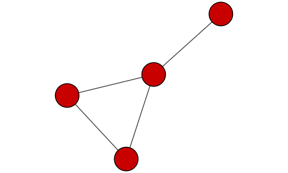
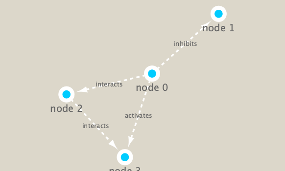

```{r setup, include=FALSE}
knitr::opts_chunk$set(echo = TRUE)
```

## Cytoscape and R

```{r}
library(RCy3)
library(igraph)
library(RColorBrewer)
```

# First Contact

These functions are a convenient way to verify a connection to Cytoscape and for logging the versions of RCy3 and Cytoscape in your scripts.

```{r}
# Test connection to Cytoscape
cytoscapePing()

```

```{r}
# Check version
cytoscapeVersionInfo()
```

```{r}
# Make a simple graph 

g <- makeSimpleIgraph()
createNetworkFromIgraph(g,"myGraph")
```

If you turn to your Cytoscape window you should now see a simple 4 vertex and 4 edge network displayed (see below).

We can include this Cytoscape rendered network image in our report with the following code:

```{r}
fig <- exportImage(filename="demo", type="png", height=350)


```

# Switch Styles

Cytoscape provides a number of canned visual styles. The code below explores some of these styles. For example check out the marquee style!

```{r}
setVisualStyle("Marquee")
```

```{r}
fig <- exportImage(filename="demo_marquee", type="png", height=350)


```

```{r}
styles <- getVisualStyleNames()
styles
```
```{r}
setVisualStyle(styles[12])
```

# Read our metagenomics data

We will read in a species co-occurrence matrix that was calculated using Spearman Rank coefficient. (see reference Lima-Mendez et al. (2015) for details).
```{r}
## scripts for processing located in "inst/data-raw/"
prok_vir_cor <- read.delim("./data/virus_prok_cor_abundant.tsv", stringsAsFactors = FALSE)

## Have a peak at the first 6 rows
head(prok_vir_cor)
```

```{r}
g <- graph.data.frame(prok_vir_cor, directed = FALSE)
g
```

From Barry: In this case the first line of output (“UNW- 854 1544 –”) tells that our network graph has 845 vertices (i.e. nodes, which represent our bacteria and viruses) and 1544 edges (i.e. linking lines, which indicate their co-occurrence). Note that the first four characters (i.e. the “UNW-” part) tell us about the network setup. In this case our network is Undirected, Named (i.e. has the ‘name’ node/vertex attribute set) and Weighted (i.e. the ‘weight’ edge attribute is set).

Common igraph functions for creating network graphs include: graph_from_data_frame(), graph_from_edgelist(), and graph_from_adjacency_matrix(). You can find out more about these functions from their associated help pages.

Our current graph is a little too dense in terms of node labels etc. to have a useful ‘default’ plot figure. But we can have a look anyway.

```{r}
# make a mess
plot(g)
```

Turn off labels

```{r}
# Turn off labels
plot(g, vertex.label=NA)
```

```{r}
# Shrink vertex size
plot(g, vertex.size=3, vertex.label=NA)
```

More info at http://igraph.org/r/doc/plot.common.html. Note that we can tune lots of plot attributes (see the help page ?igraph.plotting)

Using ggplot
```{r}
library(ggraph)
```

```{r}
ggraph(g, layout = 'auto') +
  geom_edge_link(alpha = 0.25) +
  geom_node_point(color="steelblue") +
  theme_graph()
```

To send this network to Cytoscape we can use the command:
```{r}
createNetworkFromIgraph(g,"myIgraph")
```

# Network community detection
From Barry: Community structure detection algorithms try to find dense sub-graphs within larger network graphs (i.e. clusters of well connected nodes that are densely connected themselves but sparsely connected to other nodes outside the cluster) . Here we use the classic Girvan & Newman betweenness clustering method. The igraph package has lots of different community detection algorithms (i.e. different methods for finding communities).

```{r}
cb <- cluster_edge_betweenness(g)
```

```{r}
cb
```

```{r}
plot(cb, y=g, vertex.label=NA,  vertex.size=3)
```

Use membership to extract a vector of cluster membership

```{r}
head( membership(cb) )
```

# Node degree

```{r}
# Calculate and plot node degree of our network
d <- degree(g)
hist(d, breaks=30, col="lightblue", main ="Node Degree Distribution")
```

```{r}
plot( degree_distribution(g), type="h" )
```

# Centrality analysis

```{r}

```

